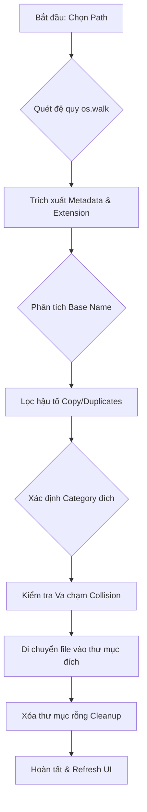
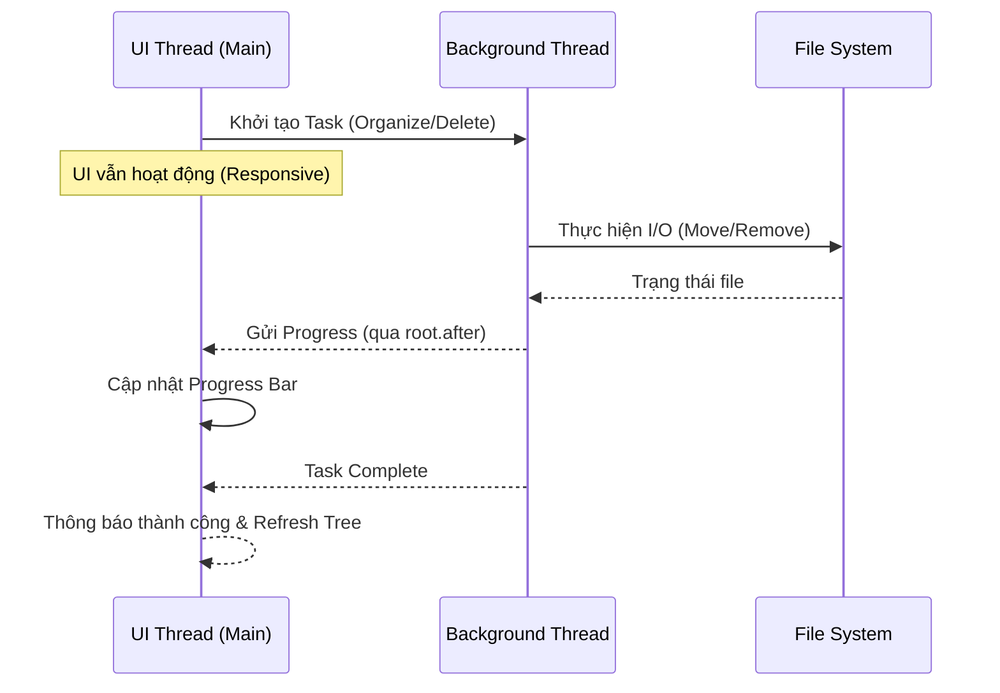

# NexOrganize v2.0

**NexOrganize** là giải pháp Desktop hiệu năng cao giúp tự động hóa việc tái cấu trúc hệ thống tệp tin hỗn loạn. Được xây dựng trên nền tảng Python với cơ chế xử lý đa luồng (Multi-threading), ứng dụng cho phép phân loại, dọn dẹp và quản lý hàng chục nghìn tệp tin với tốc độ tối ưu mà không gây nghẽn giao diện người dùng.

---

## Kiến trúc và Luồng xử lý

### 1. Luồng logic phân loại (System Workflow)
Sơ đồ mô tả quy trình từ khi người dùng chọn thư mục đến khi hoàn tất tổ chức lại cấu trúc tệp tin.

### 2. Mô hình Đa luồng (Threading Architecture)
Đảm bảo UI luôn phản hồi 1:1 bằng cách tách biệt toàn bộ I/O nặng khỏi luồng xử lý giao diện.

---

## 🛠 Cơ chế hoạt động và Logic lõi

Hệ thống hoạt động dựa trên các nguyên lý kỹ thuật sau:

### 1. Quét đệ quy (Recursive Scanning)
Sử dụng `os.walk` để duyệt toàn bộ cấu trúc thư mục con từ đường dẫn gốc. Dữ liệu được thu thập vào list bộ nhớ (`scanned_files`) để tối ưu hóa tốc độ truy xuất thay vì đọc đĩa liên tục trong quá trình xử lý.

### 2. Phân loại theo Extension Map
Các tệp tin được phân nhóm dựa trên từ điển mở rộng (`EXTENSION_MAP`). 
- Định dạng đích: `{Root}/{Category}/{BaseName}/{File}`.
- Tên thư mục phân loại (Images, Videos, Documents...) luôn được giữ ở tiếng Anh để đảm bảo tính nhất quán trong các hệ thống tệp tin kỹ thuật.

### 3. Thuật toán trích xuất Tên gốc (Base Name Extraction)
Sử dụng Regular Expressions để chuẩn hóa tên tệp tin:
- Loại bỏ các hậu tố sao chép của Windows/macOS như `- Copy`, `_copy`, ` (1)`.
- Xử lý các khoảng trắng thừa và ký tự đặc biệt ở cuối tên.
- Kết quả: Các tệp tin như `photo.jpg`, `photo (1).jpg`, `photo - Copy.jpg` sẽ được nhận diện chung một Base Name là `photo` và được gom vào cùng một thư mục con.

### 4. Xử lý Bất đồng bộ (Asynchronous Processing)
Toàn bộ các tác vụ I/O nặng (Scanning, Moving, Deleting) được triển khai trên các luồng nền (`threading.Thread`) riêng biệt.
- Giao diện người dùng (UI) giao tiếp với luồng nền qua cơ chế `root.after` của Tkinter.
- Đảm bảo UI luôn ở trạng thái Responsive (không bị treo/lag) trong suốt quá trình xử lý.

### 5. Quản lý bản sao và Va chạm (Collision Handling)
Khi di chuyển tệp tin vào thư mục đích:
- Nếu tệp tin cùng tên đã tồn tại, hệ thống tự động đánh số thứ tự (`_1`, `_2`...) cho đến khi tìm được tên tệp tin duy nhất.
- Đảm bảo không xảy ra tình trạng ghi đè mất dữ liệu.

### 6. Dọn dẹp thư mục rỗng (Empty Folder Cleanup)
Sau khi tổ chức lại tệp tin, hệ thống thực hiện quét ngược từ lá lên gốc (`topdown=False`) để xóa bỏ các thư mục rỗng, giúp làm sạch hoàn toàn cấu trúc lưu trữ cũ.

---

## Tính năng chính

- **Chuyển đổi Ngôn ngữ**: Hệ thống I18N hỗ trợ Tiếng Anh và Tiếng Việt toàn phần.
- **Chế độ Giao diện**: Tích hợp Dark/Light mode, điều chỉnh đồng bộ giữa các widget Tkinter và Text component.
- **Phân tích Metadata**: Hiển thị chi tiết thông số stats (size, created, modified) và tư vấn độ quan trọng của tệp tin.
- **Xử lý Thùng rác**: Tích hợp `send2trash` để đảm bảo an toàn dữ liệu, cho phép khôi phục khi cần thiết.

---

## Cài đặt và Khởi chạy

1. **Yêu cầu**: Python 3.8+
2. **Cài đặt thư viện**: `pip install -r requirements.txt`
3. **Chạy ứng dụng**: `python app.py`

---
**Developed for High-efficiency File Management**
