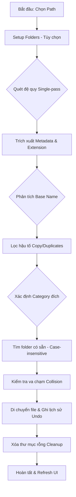
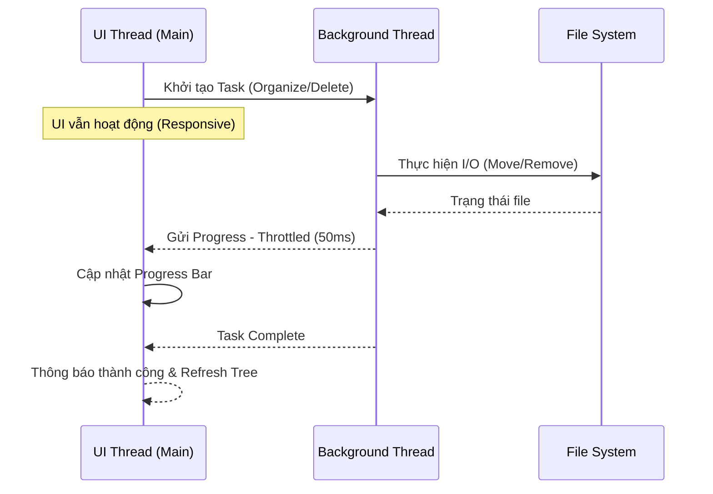

# NexOrganize v2.0

**NexOrganize** là giải pháp Desktop hiệu năng cao giúp tự động hóa việc tái cấu trúc hệ thống tệp tin hỗn loạn. Được xây dựng trên nền tảng Python với cơ chế xử lý đa luồng (Multi-threading) tối ưu, ứng dụng cho phép phân loại, dọn dẹp và quản lý hàng chục nghìn tệp tin với tốc độ cực nhanh mà không gây nghẽn giao diện người dùng.

---

## ✨ Tính năng mới v2.0

### 🚀 Hiệu suất cao
- **Single-pass scanning**: Quét 8,000+ file trong vài giây
- **Throttled progress**: Thanh tiến trình mượt mà, không treo UI
- **Async folder loading**: Xem thông tin thư mục không làm đứng app
- **Smart scan exclusion**: Bỏ qua thư mục đã phân loại (Images/, Documents/, etc.)

### ↩️ Undo (Hoàn tác)
- Ghi lại toàn bộ lịch sử di chuyển file
- Khôi phục một cú click về trạng thái ban đầu
- Tự động dọn dẹp thư mục rỗng sau khi undo

### 📁 Setup Folders (Kiểu IDM)
- Nút "Setup Folders" tạo sẵn thư mục phân loại
- Tự động sử dụng thư mục có sẵn (không phân biệt hoa/thường)
- Workflow rõ ràng: Setup → Organize → Find Duplicates

### 🔍 Nhận diện trùng lặp nâng cao
Nhận diện tất cả các pattern:
- `readme.md`, `readme(1).md`, `readme(2).md`
- `readme 1.md`, `readme 2.md`, `readme_1.md`
- `readme - Copy.md`, `readme copy.md`, `readme.copy.md`

Tất cả sẽ được nhóm vào thư mục `Documents/readme/`

### 📊 Hiển thị tiến trình quét
Panel Properties hiển thị real-time:
```
⌛ SCANNING...
Folder: D:\project\files
Current: Images
Scanned: 1,234 files
```

### 🎨 Cải thiện giao diện
- Biểu tượng đồng hồ cát khi quét/sắp xếp
- Chặn thao tác vô tình trong lúc xử lý
- Cập nhật tiến trình mỗi 100 file

---

## 🏗 Kiến trúc và Luồng xử lý

### 1. Luồng logic phân loại (System Workflow)
Sơ đồ mô tả quy trình từ khi người dùng chọn thư mục đến khi hoàn tất tổ chức lại cấu trúc tệp tin.



### 2. Mô hình Đa luồng (Threading Architecture)
Đảm bảo UI luôn phản hồi 1:1 bằng cách tách biệt toàn bộ I/O nặng khỏi luồng xử lý giao diện.



---

## 🛠 Cơ chế hoạt động và Logic lõi

### 1. Quét đệ quy tối ưu (Optimized Recursive Scanning)
- Sử dụng `os.walk` với single-pass để duyệt toàn bộ cấu trúc
- Tính toán đồng thời: size, category counts, folder stats
- Dữ liệu được thu thập vào list bộ nhớ để tối ưu tốc độ
- Bỏ qua thư mục đã phân loại (Images/, Documents/, etc.)

### 2. Phân loại theo Extension Map
Các tệp tin được phân nhóm dựa trên từ điển mở rộng (`EXTENSION_MAP`). 
- Định dạng đích: `{Root}/{Category}/{BaseName}/{File}`
- Tên thư mục phân loại (Images, Videos, Documents...) luôn được giữ ở tiếng Anh
- Tự động merge vào folder có sẵn (không phân biệt hoa/thường)

### 3. Thuật toán trích xuất Tên gốc nâng cao (Enhanced Base Name Extraction)
Sử dụng Regular Expressions để chuẩn hóa tên tệp tin:
- Loại bỏ `.copy` suffix: `file.copy.txt` → `file`
- Loại bỏ `(1)`, `(2)`: `photo(1).jpg` → `photo`
- Loại bỏ `- Copy`, `_copy`: `doc - Copy.pdf` → `doc`
- Loại bỏ trailing numbers: `report 1.xlsx`, `report_2.xlsx` → `report`
- Kết quả: Tất cả variant được gom vào cùng một thư mục con

### 4. Xử lý Bất đồng bộ với Throttling
- Toàn bộ I/O nặng chạy trên background threads
- Progress updates được throttle: cập nhật tối đa 20 lần/giây (50ms)
- Giao tiếp qua `root.after` của Tkinter
- UI luôn responsive, có thể di chuyển cửa sổ trong lúc xử lý

### 5. Hệ thống Undo hoàn chỉnh
- Ghi lại mọi thao tác di chuyển: `[(source, dest), ...]`
- Reverse operations khi undo: di chuyển file về vị trí cũ
- Tự động dọn dẹp thư mục rỗng sau undo
- Nút Undo được enable/disable tự động

### 6. Quản lý bản sao và Va chạm (Collision Handling)
Khi di chuyển tệp tin vào thư mục đích:
- Nếu tệp tin cùng tên đã tồn tại, tự động đánh số (`_1`, `_2`...)
- Đảm bảo không xảy ra tình trạng ghi đè mất dữ liệu

### 7. Dọn dẹp thư mục rỗng (Empty Folder Cleanup)
- Quét ngược từ lá lên gốc (`topdown=False`)
- Xóa bỏ thư mục rỗng, giữ nguyên category folders
- Làm sạch hoàn toàn cấu trúc lưu trữ cũ

---

## 📋 Workflow sử dụng

1. **Setup Folders** (Lần đầu): Click "Setup Folders" → Tạo 7 thư mục category
2. **Organize**: Click "Organize" → File tự động phân loại + nhóm trùng lặp
3. **Undo**: Nhấn "Undo" nếu muốn hoàn tác
4. **Find Duplicates**: Vào từng thư mục category → Click "Find Duplicates"

---

## 🎯 Tính năng chính

- **Chuyển đổi Ngôn ngữ**: Hệ thống I18N hỗ trợ Tiếng Anh và Tiếng Việt
- **Chế độ Giao diện**: Dark/Light mode, điều chỉnh đồng bộ
- **Phân tích Metadata**: Stats chi tiết (size, created, modified) và tư vấn độ quan trọng
- **Xử lý Thùng rác**: Tích hợp `send2trash` để đảm bảo an toàn dữ liệu
- **Visual Feedback**: Hourglass cursor, modal dialogs, progress throttling

---

## 🚀 Cài đặt và Khởi chạy

1. **Yêu cầu**: Python 3.8+
2. **Cài đặt thư viện**: `pip install -r requirements.txt`
3. **Chạy ứng dụng**: `python app.py`

---

## 📊 Performance

- ✅ Quét 8,000+ files: < 5 giây
- ✅ UI responsive: Không bao giờ treo
- ✅ Memory efficient: Single-pass scan
- ✅ Safe operations: Undo + Recycle Bin support

---

**Developed for High-efficiency File Management**
